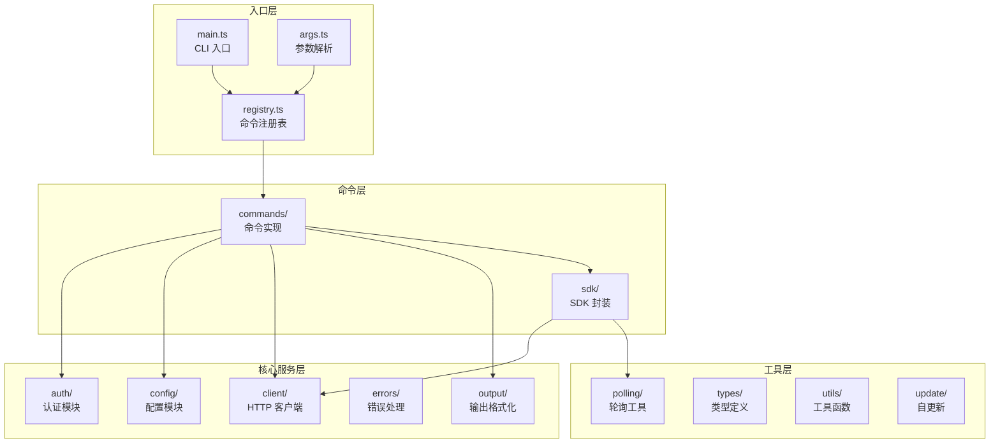
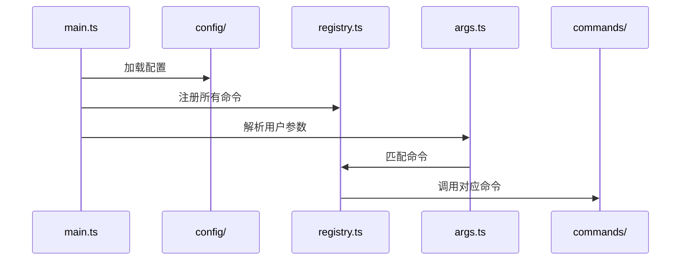
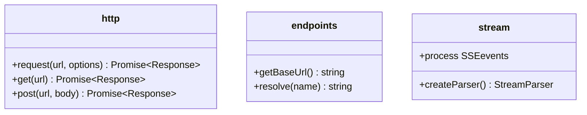
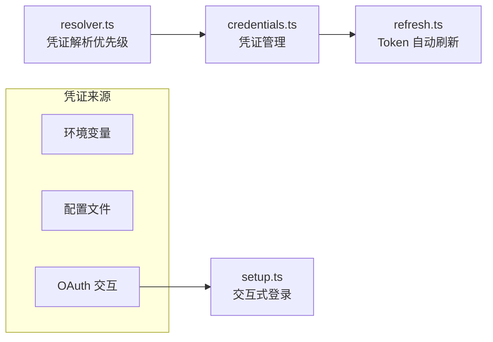
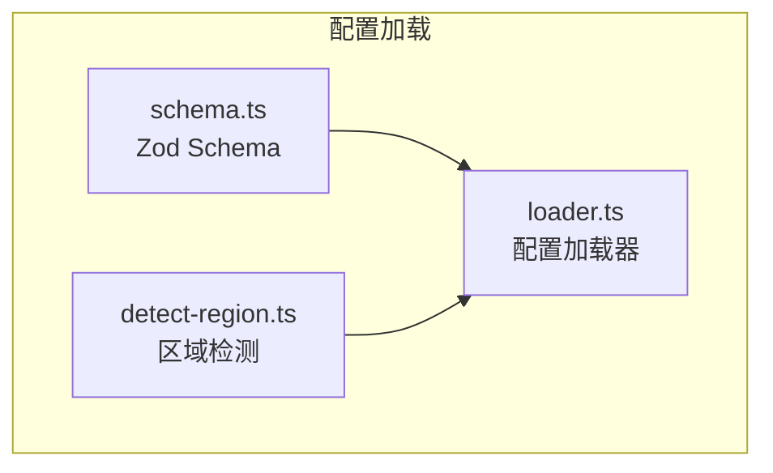
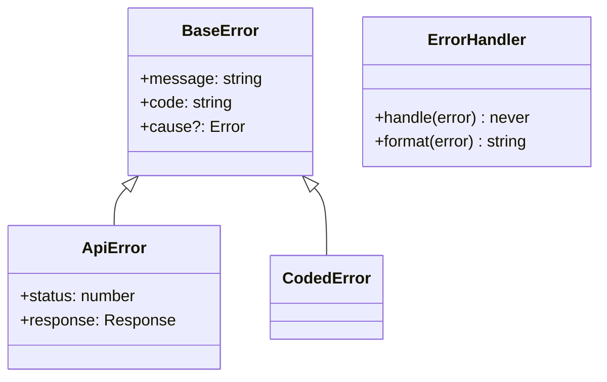
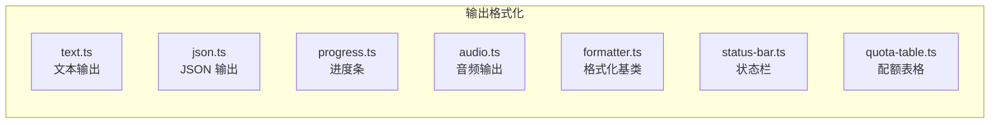
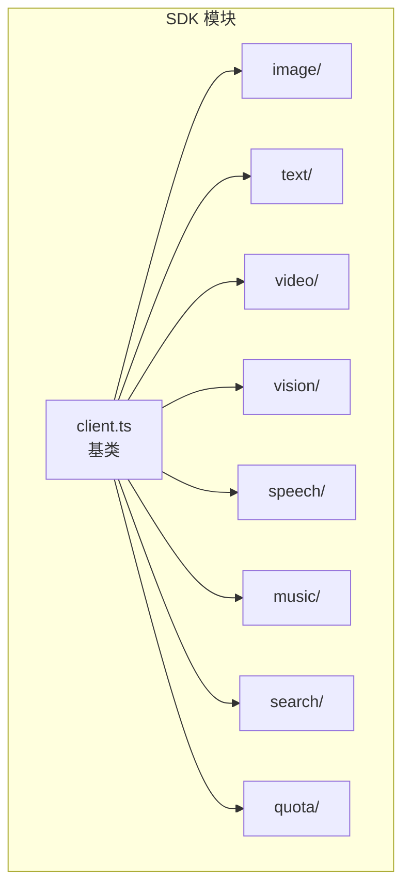
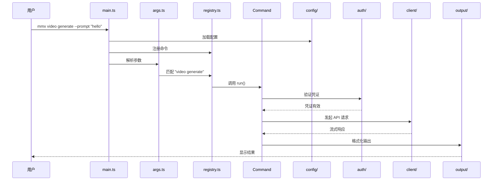

# mmx-cli 架构文档

## 项目概览

| 属性 | 值 |
|------|-----|
| 项目名 | mmx-cli |
| 语言 | TypeScript（strict mode） |
| 运行时 | Bun 原生 / Node.js 18+ |
| 模块 | ESM |
| 许可证 | MIT |
| 包管理 | bun + npm |

## 整体架构



## 目录结构

```
src/
├── auth/           # 认证（login, oauth, refresh, credentials）
├── client/         # HTTP 客户端，端点，流式响应
├── command.ts      # 命令接口定义
├── commands/       # 命令实现
│   ├── auth/       # 认证命令（login, logout, status, refresh）
│   ├── config/     # 配置命令（show, set, export-schema）
│   ├── file/       # 文件命令（list, upload, delete）
│   ├── image/      # 图像命令（generate）
│   ├── music/      # 音乐命令（generate, cover, models）
│   ├── quota/      # 配额命令（show）
│   ├── speech/     # 语音命令（synthesize, voices）
│   ├── search/     # 搜索命令（query）
│   ├── text/       # 文本命令（chat）
│   ├── video/      # 视频命令（generate, download, task-get）
│   ├── vision/     # 视觉命令（describe）
│   ├── help.ts     # 帮助命令
│   └── update.ts   # 更新命令
├── config/         # 配置加载，Schema，区域检测
├── errors/         # 错误处理（base, api, codes, handler）
├── output/         # 输出格式化（text, json, progress, audio 等）
├── polling/        # 轮询工具
├── sdk/            # API SDK 封装
│   ├── client.ts   # SDK 客户端基类
│   ├── types.ts    # SDK 类型定义
│   ├── index.ts    # SDK 导出入口
│   ├── image/      # 图像 SDK
│   ├── text/       # 文本 SDK
│   ├── video/      # 视频 SDK
│   ├── vision/     # 视觉 SDK
│   ├── speech/     # 语音 SDK
│   ├── music/      # 音乐 SDK
│   ├── search/     # 搜索 SDK
│   └── quota/      # 配额 SDK
├── types/          # 类型定义（api, commands, flags）
├── utils/          # 工具函数（fs, token, env, prompt, schema）
├── update/         # 自更新检查
├── args.ts         # 参数解析
├── main.ts         # CLI 入口
└── registry.ts     # 命令注册表
```

## 核心模块解析

### 入口层

#### main.ts
CLI 主入口，负责初始化配置、注册命令、启动命令行解析。



#### registry.ts
命令注册中心，统一管理所有命令的定义和路由。

#### args.ts
参数解析器，将命令行输入解析为结构化的 flags 和位置参数。

#### command.ts
定义 `CommandSpec` 接口，所有命令必须实现此接口：

```typescript
interface CommandSpec {
  name: string;              // 命令名称
  description: string;      // 命令描述
  options?: OptionDef[];     // 选项定义
  run: (config: Config, flags: GlobalFlags) => Promise<void>;
}
```

---

### client/

HTTP 通信层，负责所有 API 请求。



| 文件 | 职责 |
|------|------|
| `http.ts` | HTTP 请求（Bun 原生 fetch） |
| `endpoints.ts` | API 端点管理 |
| `stream.ts` | 流式响应处理（SSE/Server-Sent Events） |

---

### auth/

认证模块，管理用户登录态和凭证。



| 文件 | 职责 |
|------|------|
| `credentials.ts` | 凭证存取管理 |
| `oauth.ts` | OAuth 2.0 流程 |
| `refresh.ts` | Access Token 自动刷新 |
| `resolver.ts` | 多源凭证解析优先级 |
| `setup.ts` | 交互式登录向导 |
| `types.ts` | 认证类型定义 |

---

### config/

配置管理，支持文件配置和环境变量。



| 文件 | 职责 |
|------|------|
| `schema.ts` | Zod 配置 Schema 定义 |
| `loader.ts` | 多来源配置加载（文件 > 环境变量 > 默认值） |
| `detect-region.ts` | 自动区域检测 |
| `paths.ts` | 配置文件路径管理 |

---

### errors/

错误处理体系，采用分层错误类型。



| 文件 | 职责 |
|------|------|
| `base.ts` | 基础错误类 |
| `api.ts` | API 错误（HTTP 状态码、响应解析） |
| `codes.ts` | 错误码定义 |
| `handler.ts` | 全局错误处理器 |

---

### output/

输出格式化，支持多种输出格式。



| 文件 | 职责 |
|------|------|
| `text.ts` | 纯文本输出 |
| `json.ts` | JSON 格式化输出 |
| `progress.ts` | 进度条渲染 |
| `audio.ts` | 音频流输出 |
| `formatter.ts` | 格式化器基类 |
| `status-bar.ts` | 底部状态栏 |
| `quota-table.ts` | 配额表格展示 |

---

### sdk/

API SDK 封装，提供各模块的编程接口。



---

### types/

TypeScript 类型定义。

| 文件 | 职责 |
|------|------|
| `api.ts` | API 响应类型 |
| `commands.ts` | 命令相关类型 |
| `flags.ts` | 全局 flags 类型 |

---

### utils/

通用工具函数。

| 文件 | 职责 |
|------|------|
| `fs.ts` | 文件系统操作 |
| `token.ts` | Token 编解码 |
| `env.ts` | 环境变量工具 |
| `prompt.ts` | 交互式提示 |
| `schema.ts` | Schema 工具函数 |

---

### polling/

长轮询工具，用于异步任务状态查询。

| 文件 | 职责 |
|------|------|
| `poll.ts` | 轮询实现 |

---

### update/

自更新功能。

| 文件 | 职责 |
|------|------|
| `checker.ts` | 更新检查 |
| `self-update.ts` | 自我更新执行 |

---

## 命令执行流程



## 数据流

```
用户输入
    │
    ▼
args.ts (参数解析)
    │
    ▼
registry.ts (命令匹配)
    │
    ▼
commands/* (业务逻辑)
    │
    ├──► auth/ (身份验证)
    │
    ├──► config/ (配置读取)
    │
    └──► client/ (HTTP 请求)
              │
              ▼
         API Server
              │
              ▼
        stream.ts (流式处理) / polling/ (轮询)
              │
              ▼
         output/ (格式化输出)
              │
              ▼
         用户终端
```

## 关键技术选型

| 领域 | 选型 | 原因 |
|------|------|------|
| 运行时 | Bun / Node.js 18+ | 兼顾性能与兼容性 |
| 类型检查 | TypeScript strict mode | 减少运行时错误 |
| 配置校验 | Zod | 运行时类型验证 |
| HTTP 客户端 | Bun.fetch | 原生支持，流式响应 |
| 模块格式 | ESM | 现代 JavaScript 标准 |
